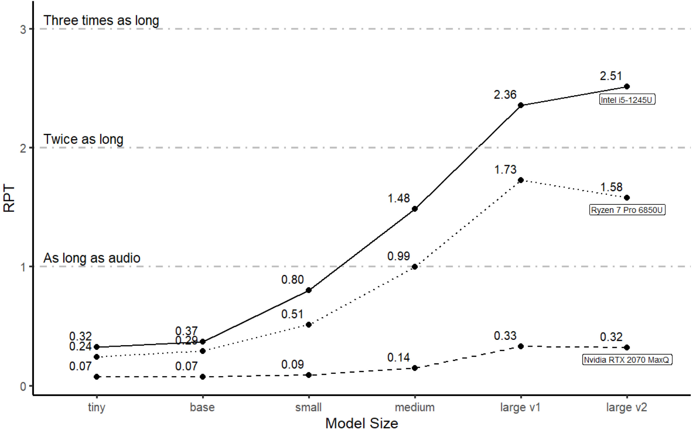
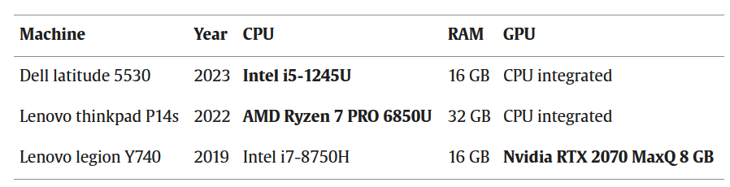
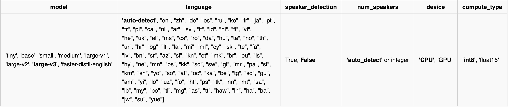

## Tl;dr
aTrain-core: A command line interface for the transcription of audio and video files ([faster-whisper](https://github.com/SYSTRAN/faster-whisper)), including speaker diarization ([pyannote-audio](https://github.com/pyannote/pyannote-audio)). It runs on Windows, MacOS and Debian-based Linux distributions. Supports all the newest models, including Whisper large V3 and distilled large v3 model (English, real time transcription on CPU).

Learn [how to install](https://github.com/JuergenFleiss/atrain_core#installation-%EF%B8%8F) and [how to use](https://github.com/JuergenFleiss/atrain_core#usage-) it.

📝 If you use aTrain for a publication, please cite [our paper](https://www.sciencedirect.com/science/article/pii/S2214635024000066?via%3Dihub) as per our [license](https://github.com/JuergenFleiss/atrain_core?tab=License-1-ov-file). 

## Accessible Transcription of Interviews
aTrain-core is a command line interface tool for automatically transcribing speech recordings including speaker recognition utilizing state-of-the-art machine learning models. It does so without uploading any data. It was developed by researchers at the Business Analytics and Data Science-Center at the University of Graz and tested by researchers from the Know-Center Graz. 

aTrain-core also comes as the [aTrain app](https://github.com/JuergenFleiss/aTrain) where it is bundled with a nice graphical user interface. Available for Windows (10 and 11) via the Microsoft app store ([Link](https://apps.microsoft.com/store/detail/atrain/9N15Q44SZNS2)) or by downloading the installer from the BANDAS-Center Website ([Link](https://business-analytics.uni-graz.at/de/forschen/atrain/download/)). For the GUI in Linux, follow the [instructions here](https://github.com/JuergenFleiss/aTrain/wiki/Linux-Support-(in-progress)).

The paper introducing aTrain has been published in the Journal of Behavioral and Experimental Finance. Please cite the published paper if you used aTrain for your research: [Take the aTrain. Introducing an Interface for the Accessible Transcription of Interviews.](https://www.sciencedirect.com/science/article/pii/S2214635024000066)


aTrain-core offers the following benefits:
\
\
**Fast and accurate 🚀**
\
aTrain-core is a CLI tool for the [faster-whisper](https://github.com/guillaumekln/faster-whisper) implementation of OpenAI’s [Whisper model](https://github.com/openai/whisper), ensuring best in class transcription quality (see [Wollin-Geiring et al. 2023](https://www.static.tu.berlin/fileadmin/www/10005401/Publikationen_sos/Wollin-Giering_et_al_2023_Automatic_transcription.pdf)) paired with higher speeds on your local computer. Transcription when selecting the highest-quality model takes only around three times the audio length on current mobile CPUs typically found in middle-class business notebooks (e.g., Core i5 12th Gen, Ryzen Series 6000).
\
\
**Speaker detection 🗣️**
\
aTrain-core has a speaker detection mode based on [pyannote.audio](https://github.com/pyannote/pyannote-audio) and can analyze each text segment to determine which speaker it belongs to.
\
\
**Privacy Preservation and GDPR compliance 🔒**
\
aTrain-core processes the provided speech recordings completely offline on your own device and does not send recordings or transcriptions to the internet. This helps researchers to maintain data privacy requirements arising from ethical guidelines or to comply with legal requirements such as the GDRP.
\
\
**Multi-language support 🌍**
\
aTrain-core can process speech recordings a total of 99 languages, including Afrikaans, Arabic, Armenian, Azerbaijani, Belarusian, Bosnian, Bulgarian, Catalan, Chinese, Croatian, Czech, Danish, Dutch, English, Estonian, Finnish, French, Galician, German, Greek, Hebrew, Hindi, Hungarian, Icelandic, Indonesian, Italian, Japanese, Kannada, Kazakh, Korean, Latvian, Lithuanian, Macedonian, Malay, Marathi, Maori, Nepali, Norwegian, Persian, Polish, Portuguese, Romanian, Russian, Serbian, Slovak, Slovenian, Spanish, Swahili, Swedish, Tagalog, Tamil, Thai, Turkish, Ukrainian, Urdu, Vietnamese, and Welsh. A full list can be found [here](https://github.com/openai/whisper/blob/main/whisper/tokenizer.py). Note that transcription quality varies with language; word error rates for the different languages can be found [here](https://github.com/openai/whisper?tab=readme-ov-file#available-models-and-languages).
\
\
**MAXQDA, ATLAS.ti and nVivo compatible output 📄**
\
aTrain-core provides transcription files that are seamlessly importable into the most popular tools for qualitative analysis, ATLAS.ti, MAXQDA and nVivo. This allows you to directly play audio for the corresponding text segment by clicking on its timestamp. Go to the [tutorial](https://github.com/BANDAS-Center/aTrain/wiki/Tutorials) for MAXQDA.
\
\
**Nvidia GPU support 🖥️**
\
aTrain-core can either run on the CPU or an NVIDIA GPU (CUDA toolkit installation required, supported in Debian and Windows). A [CUDA-enabled NVIDIA GPU](https://developer.nvidia.com/cuda-gpus) significantly improves the speed of transcriptions, reducing transcription time to 20% of audio length on current entry-level gaming notebooks.

## Benchmarks
For testing the processing time of aTrain-core we transcribe a [conversation between Christine Lagarde and Andrea Enria at the Fifth ECB Forum on Banking Supervision 2023](https://www.youtube.com/watch?v=kd7e3OXkajY) published on YouTube by the European Central Bank under a Creative Commons license , downloaded as 320p MP4 video file. The file has a duration of exactly 22 minutes on was transcribed on three different computers (see table "Used hardware") with speaker detection enabled. The figure below shows the processing time of each transcription relative to the length of the speech recording. In this relative processing time (RPT), a transcription is considered ’real time’ when the recording length and the processing time are equal. Subsequently, faster transcriptions lead to an RPT below 1 and slower transcriptions to an RPT time above 1.

| Benchmark results | Used hardware |
| --- | --- |
|  |  |


## Installation ⚙️

**You need to have python >=3.10 installed**  

First you need to create and activate a virtual environment


**Windows**
```
python -m venv venv
.\venv\Scripts\activate
```

**Debian und MacOS**
```
python3 -m venv venv
source venv/bin/activate
```

Then you need to clone our repository into that directory including the extra index. The extra index downloads the necessary libraries for GPU support. 

**Windows**
```
pip install aTrain_core@git+https://github.com/JuergenFleiss/aTrain_core.git --extra-index-url https://download.pytorch.org/whl/cu118
```
**Debian** 
```
pip3 install aTrain_core@git+https://github.com/JuergenFleiss/aTrain_core.git --extra-index-url https://download.pytorch.org/whl/cu118
```
💡 Linux keeps killing collection of torch? Try adding the flag--no-cache-dir

**MacOS** 
```
pip3 install aTrain_core@git+https://github.com/JuergenFleiss/aTrain_core.git
```
💡 Note: At the moment, NVIDIA CUDA GPU support is only available for Windows and Debian. We are working on speeding up the transcriptions on MacOS. Hence no need to install the extra index on MacOS. 

## Usage 📚

Here's a list of all possible model configurations with **default settings in bold**. 




If you wish to keep default settings you can simply run: 
```
aTrain_core transcribe /path/to/audio/file.mp3
```
By adapting the following flags you can specify 

```
aTrain_core transcribe /path/to/audio/file.mp3 --model <MODEL> --language <LANGUAGE> --speaker_detection --num_speakers <NUM_SPEAKERS> --device <DEVICE> --compute_type <COMPUTE_TYPE>
```

💡 Good to know: As opposed to the other specifications where the name of model, etc. has to be stated explicitly, the speaker detection is activated simply by adding the flag ```--speaker_detection```

💡 The specified model in the transcription (either default or other) is automatically downloaded into the ```models```folder in the same ```aTrain_core``` root directory where you can find the ```transcriptions```. The ```aTrain_core```directory can be found in your machine's ```Documents``` folder.

💡If you use one of the newer distilled models (currently only ```faster-distil-english``` based on large v3) you need to specify the corresponding language, as they are single language only.

If you wish to download all models (separately from the transcription process), simply run: 

```
aTrain_core load
```


## System requirements
We support Windows, Debian and MacOS (tested with M1 processors only). GPU transcription with NVIDIA CUDA GPUs is supported in Windows and Debian. 


